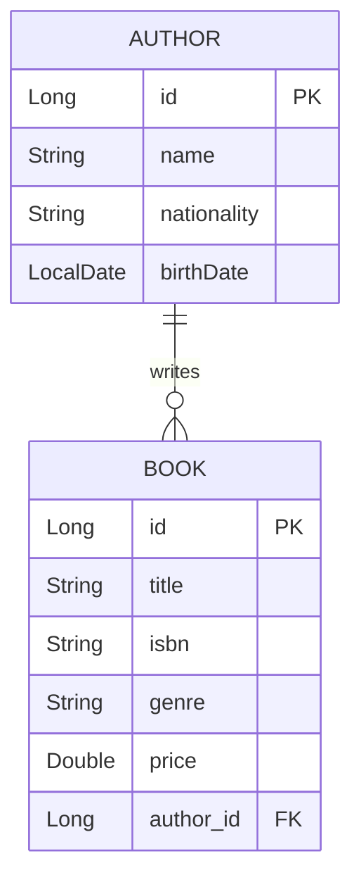

# Project Documentation: Spring Boot Library Management System

## 1. Approach and Design
This project implements a robust Library Management System using Spring Boot, JPA, and JSP. The goal was to manage two related entities—**Authors** and **Books**—while adhering to standard enterprise architecture patterns.

### Entity Relationship Design
- **Author Entity**: Represents a writer with attributes like `name`, `nationality`, and `birthDate`.
- **Book Entity**: Represents a publication with `title`, `isbn`, `genre`, and `price`.
- **Relationship**: A **One-to-Many** relationship exists between Author and Book. One author can write multiple books, while each book is associated with exactly one author. This is implemented using `@OneToMany` in `Author` and `@ManyToOne` with a `@JoinColumn` in `Book`.



## 2. Implementation Details

### CRUD Operations
1. **Create**: Implemented via JSP forms (`add-author.jsp`, `add-book.jsp`). Data is bound to the model and saved through the Service layer.
2. **Read**: Implemented a comprehensive list view for both entities. Includes a **Custom Inner Join Query** in the `AuthorRepository` to fetch authors who have published books.
3. **Update**: Handled through edit forms that prepopulate existing data using `@PathVariable` and model binding.

### Custom Query
The repository layer includes a custom JPQL query:
```java
@Query("SELECT DISTINCT a FROM Author a JOIN FETCH a.books")
List<Author> findAuthorsWithBooks();
```
This query ensures that only authors with at least one book are retrieved, demonstrating an inner join with fetch joining to prevent N+1 issues.

### Technology Stack
- **Backend**: Spring Boot 3.2, Spring Data JPA, H2 Database.
- **Frontend**: JSP, JSTL, Vanilla CSS.
- **Testing**: JUnit 5, Mockito.

## 3. Challenges Faced & Solutions

### Challenge 1: JSP Support in Spring Boot
**Problem**: Modern Spring Boot versions do not support JSP by default when packaged as a JAR.
**Solution**: Included `tomcat-embed-jasper` and configured the internal view resolver in `application.properties`.

### Challenge 2: Integrity Violations
**Problem**: Trying to save a book without a valid author ID or an author with invalid data.
**Solution**: Implemented `try-catch` blocks in the Controller layer and used `RedirectAttributes` to pass error messages back to the UI.

### Challenge 3: Modern UI with JSP
**Problem**: JSP pages often look outdated.
**Solution**: Developed a custom CSS design system using CSS variables, gradients, and modern typography (Inter) to give the application a premium, state-of-the-art feel.

## 4. How to Run
1. Navigate to the project directory: `cd database-assignment`
2. Run the application: `mvn spring-boot:run` (or use your IDE).
3. Access the dashboard at: `http://localhost:8080`
4. Access H2 Console at: `http://localhost:8080/h2-console` (Username: `sa`, Password: [empty])

---
**GitHub URL**: [User to insert their URL here]
